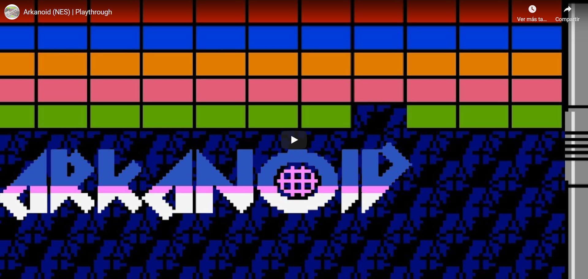
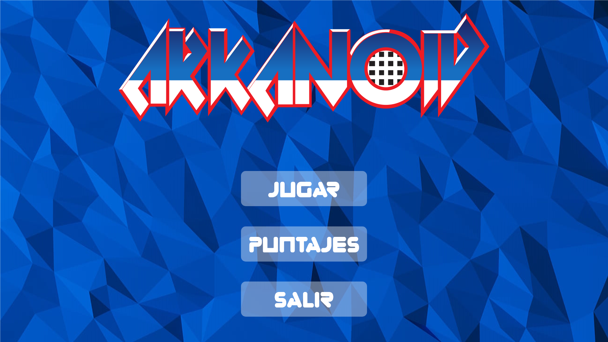
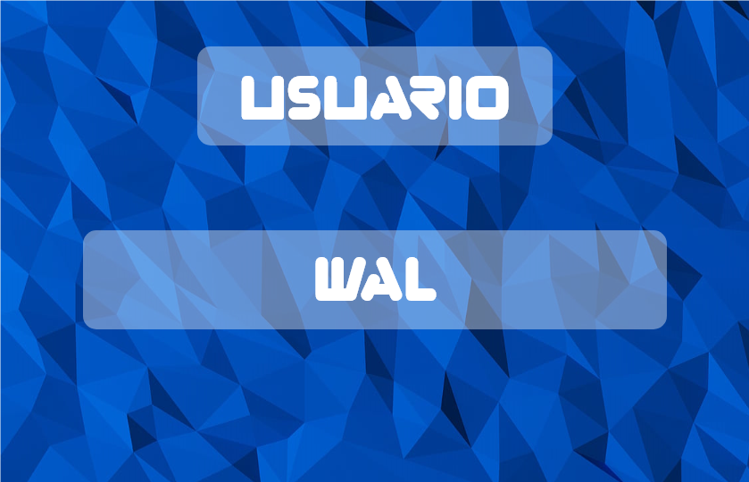
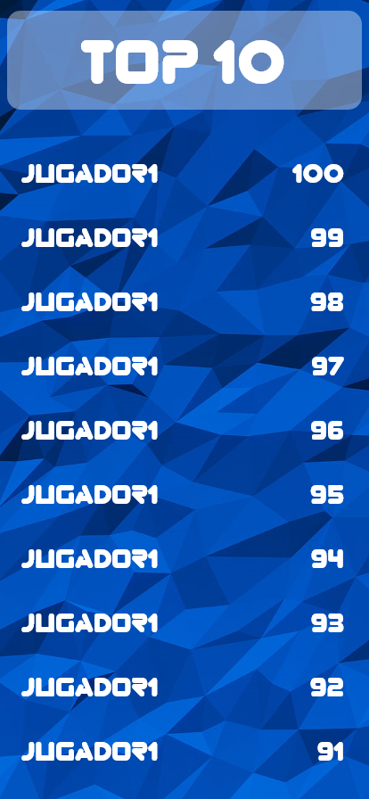
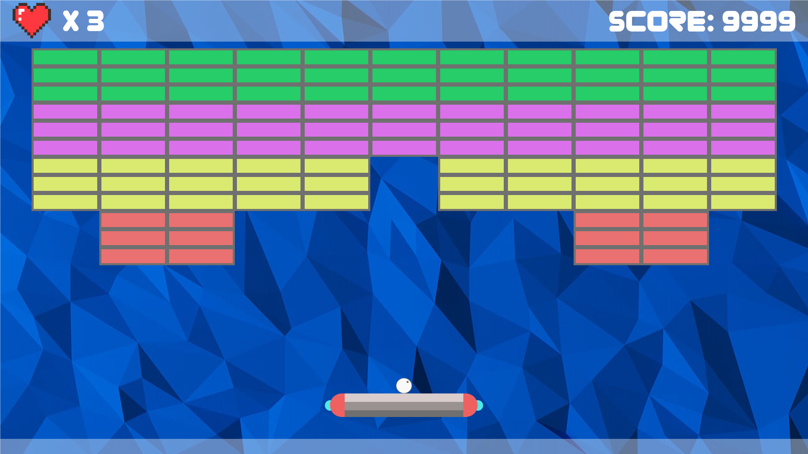
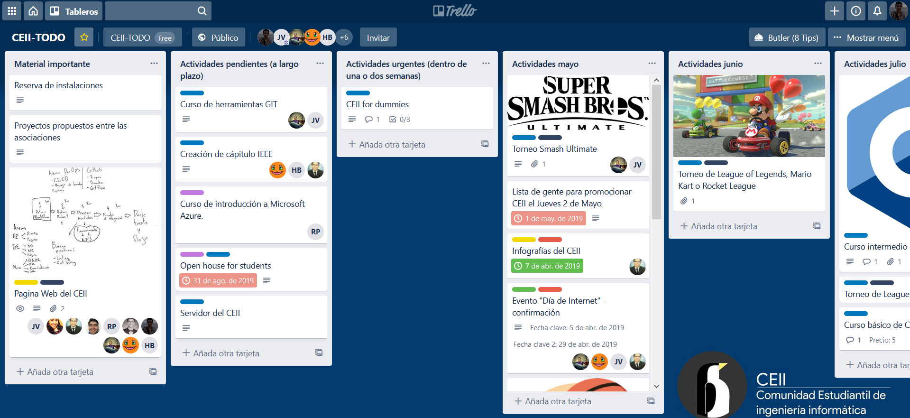
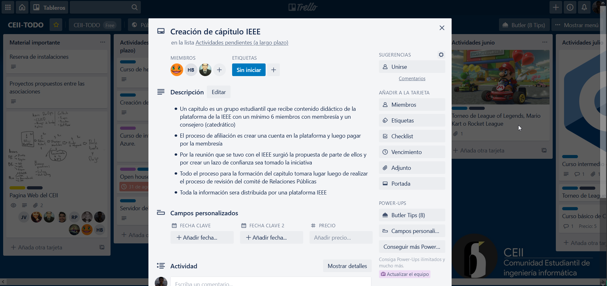

# Proyecto final - POO

## Avisos
* Ver [**método de entrega**](#método-de-entrega) 
* Aclaración: **deberán implementar como mínimo 5 excepciones personalizadas a lo largo de su código**.
* Añadidas sprites para uso de todos, en dado caso no quieran crear las propias. No es evaluado si las crean o no
* El manual técnico cambia entre los grupos de tres y cuatro personas, leer sección de [documentación](#documentación)
* Entrega primer avance - **sábado 13 de junio (sin ponderación)**
* Entrega final - **lunes 22 de junio**
* Elementos que **obligatoriamente** deben ser cargados desde código: todo lo que tenga que ver con el UserControl/Form del juego. Cosas como el menú o el top pueden ser trabajadas con el designer.

## Sumario
[**Definición formal**](#definición-formal)  
&nbsp;&nbsp;&nbsp;&nbsp;[Menú principal](#menú-principal) 
&nbsp;&nbsp;&nbsp;&nbsp;[Jugabilidad](#jugabilidad) 
[**Requerimientos técnicos**](#requerimientos-técnicos) 
&nbsp;&nbsp;&nbsp;&nbsp;[Conexión a BD](#conexión-a-bd) 
&nbsp;&nbsp;&nbsp;&nbsp;[Paradigma orientado a objetos](#paradigma-orientado-a-objetos) 
&nbsp;&nbsp;&nbsp;&nbsp;[Implementación del MVC](#implementación-del-mvc) 
&nbsp;&nbsp;&nbsp;&nbsp;[Buenas prácticas](#buenas-prácticas) 
&nbsp;&nbsp;&nbsp;&nbsp;[Repositorio de GitHub](#repositorio-de-github) 
[**Requerimientos metodológicos**](#requerimientos-metodológicos) 
&nbsp;&nbsp;&nbsp;&nbsp;[Herramientas](#herramientas) 
&nbsp;&nbsp;&nbsp;&nbsp;[Problemas en flujo de trabajo](#problemas-en-flujo-de-trabajo) 
[**Documentación**](#documentación) 
[**Método de entrega**](#método-de-entrega) 

## Definición formal
El proyecto final de la materia consistirá en la recreación de un juego clásico, **Arkanoid**. Para las personas que nunca lo han jugado o escuchado, acá un breve video.

Se pretende que el juego sea totalmente funcional, y que conste de un único nivel a su creatividad. El programa como tal deberá contener los siguientes aspectos:

### Menú principal

Deberá contener las siguientes opciones:

**Jugar** 
Deberá solicitar un nombre de jugador a través de una pequeña ventana o cambio de panel dentro de la principal. El nombre del jugador deberá ir a buscar su existencia en una **BD**, en caso no exista deberá agregarse.

**Puntajes** 
Se mostrará una ventana externa conteniendo un **Top 10** mejores puntajes, mostrando el nombre del jugador/usuario y el puntaje obtenido.

### Jugabilidad
La jugabilidad es esencial, y deberá ser fluida. Queda a disposición de los programadores la manera de desplazar la nave, los 
[sprites](https://www.geekno.com/glosario/sprites)
a utilizar, la disposición de los cuadros en pantalla, la movilidad si será con las direccionales, el WASD o el mouse, entre otros aspectos.

Los aspectos que son **obligatorios** en la jugabilidad serán:

* Un sistema de vidas 
Que el jugador inicie con una cantidad **n** y  a medida falle disminuyan hasta perder el juego.
* Un sistema de puntaje 
No podrán haber una disposición de bloques donde **todos sean del mismo color**. Dependiendo del color del bloque así será el puntaje.
* Diferenciación de destrucción de bloques 
Como mínimo, deben haber dos niveles de destrucción. A lo que esto refiere es la cantidad de veces que la bola/proyectil debe tocar el bloque para destruirlo. Pueden ser que bloques requieran 1 toque, mientras que otros necesiten 3.

## Requerimientos técnicos
Para los requerimientos técnicos, deberán implementar los siguientes elementos:

### Conexión a BD
Su programa deberá conectarse a una BD que deberá ser **creada** por su grupo de trabajo, en PostgreSQL.

### Paradigma orientado a objetos
A lo largo de su código deberá verse reflejado el aprendizaje de la materia, aplicando definiciones de clase e instanciaciones de objetos, conceptos como polimorfismo, clases estáticas, etc.

### Implementación del MVC
La organización de su código fuente en su solución debe aplicar la normativa del Modelo Vista-Controlador.

### Buenas prácticas
Su código fuente debe ser legible y estar comentado en las partes importantes. El **80%** de su código debe estar en inglés (nombres de funciones, variables, clases, atributos, etc. Los comentarios no, esos pueden ir en español).

### Repositorio de GitHub
La utilización del sistema de control de versiones Git será obligatoria. Su repositorio será público y nombrado de la siguiente manera:

**NombreGrupo_Arkanoid**

No se permitirá que hayan commits de un único contribuyente, todos los miembros del grupo deberán aportar.

## Requerimientos metodológicos

### Herramientas
En cuanto a requerimientos metodológicos, es necesaria la buena comunicación y organización de su equipo de trabajo.

Se evaluará la utilización de herramientas de planificación, como tableros u organigramas. La herramientra propuesta para la materia es 
[Trello](https://trello.com/). 

 

Trello consiste en la implemetación de un tablero, que contiene listas, y a su vez estas listas contienen tarjetas con información escrita por los miembros.

Se pretende que las listas estén categorizadas, por importancia, tipo de actividad, etc.

 

Las tarjetas dentro de las listas corresponden a actividades, y pueden ser personalizadas, agregando fechas límites, marcarlas con etiquetas, agregar miembros a la actividad, checklists, etc.

Su grupo de trabajo deberá crear un tablero y enlazarlo a GitHub.

### Problemas en flujo de trabajo
Si se dan problemas en el flujo de trabajo, por ejemplo, si un miembro no aporta, si hay desacuerdos, etc. estos deberán ser reportados en una **lista** de Trello. Esta lista se llamará **Issues** y deberá existir una tarjeta dentro de ella por cada problema presentado. 

Estos problemas **no** deberán ser reportados a su instructor/catedrático. En la revisión de su proyecto, se visualizarán los problemas que existan y se evaluará la nota de los miembros que no participen según esta información. También se tomará en consideración si se reportan otros errores para no afectar la nota grupal.

No se permitirá un tablero que no tenga esta lista, y que en esta lista no existan tarjetas.

## Documentación

### Para todos los grupos
Deberán entregar un manual técnico acerca de lo implementado en su proyecto. Este documento contendrá los siguientes elementos:

* Aspectos generales 
Contendrá la información del objetivo del documento, una descripción general del proyecto y el Software utilizado para la creación del mismo.
* UML 
Un diagrama de clases basado en su proyecto.
* Diagrama Entidad Relación Extendido 
Referente a la base de datos
* Diagrama Relacional
* Conceptos técnicos y distintos tipos de error 
Lista de clases implementadas y breve descripción. **No se consideran los eventos y excepciones**.
* Nomenclaturas 
Abreviaciones de nombres de variables utilizadas y su referencia.
* Eventos y excepciones.
Lista de eventos y excepciones con breve descripción.

[**Ver ejemplo de Manual Técnico**](https://drive.google.com/open?id=1dNDDZ_IYtaahgp0GBz18LiPQwmzV5g4W)

### Adicional para los grupos de cuatro integrantes
En la sección de UML del Manual Técnico deberá agregar un UML de diagrama de casos de uso.

## Método de entrega
Para tener **derecho** a calificación deberá seguir **al pie de la letra** las siguientes indicaciones:

<ul>
  <li>
    Deberá tener dentro de su repositorio los siguientes elementos:
    <ul>
      <li>Una carpeta llamada SourceCode que contenga el código fuente de su proyecto</li>
      <li>Una carpeta llamada Documentación, que deberá contener el manual técnico, el script utilizado de la base de datos, y dos archivos en formato PNG que corresponderán al diagrama relacional normalizado de su base de datos, y el diagrama de clases. <b>Para grupos de más de cuatro integrantes, recordar anexar también el manual de usuario</b></li>
      <li>Un archivo README.md con la estructura mencionada acá</li>
    </ul>
  </li>
  <li>Crear un release en GitHub. Esto lo puede hacer en la pestaña releases de la barra de su repositorio, seleccionará <b>Create new Release</b>, en la ventana que cargue:
    <ul>
      <li>En Tag Version deberá colocar <b>v1.0.0</b></li>
  <li>En @master (justo a la par del Tag Version), deberá dar clic y seleccionar commits, luego el commit más reciente realizado</li>
  <li>En Release Title <b>Arkanoid Project Release</b></li>
  <li>Y finalmente en la parte donde dice "Describe this release" debe colocar cinco aspectos importantes del proyecto.</li>
     <b>Ojo: este proceso debe ser realizado únicamente por una persona del grupo</b>
    </ul>
  </li>
</ul>
PD: si en su proyecto utilizó fuentes personalizadas, recuerde abrir un issue en **este** repositorio, con el nombre de la fuente que utilizó y su link de descarga. Si un grupo no lo hace, y el programa lanza una excepción, entonces tendrá disminución en su nota por no seguir indicaciones.
 
<b><a href="https://github.com/Walter26/ProyectoPOO/releases/tag/v1.0.0" target="_blank">Ver ejemplo de release</a></b>

## Formato de archivo README
El archivo README que colocará en su repositorio deberá estar escrito en **MarkDown**, y su extensión debe ser README.md, esto puede crearse propiamente desde GitHub, editores de código como Atom, VSCode, o incluso desde IDEs como Rider.

El README deberá contener:

<ol>
  <li>Como título el nombre de su grupo</li>  
  <li>Como subtítulo o título 2 la palabra "Integrantes", y luego una lista con los nombres y carnets de cada uno de los integrantes de su equipo</li>
  <li>Como subtítulo o título 2, la palabra "IDE", y luego el IDE utilizado. Si por alguna razón utilizaron más de uno, especificar</li>
  <li>Como subtítulo o título 2, la palabra "FAQ's" que hace referencia a "Frequently Asked Questions", en la cuál deberá colocar mínimo 5 preguntas (con su respuesta) que un usuario pueda hacerle a usted como desarrollador acerca del <b>funcionamiento</b>, ojo, no son preguntas respecto al código, ni como hicieron tal cosa, sino preguntas como:
    <ul>
      <li>¿Cómo iniciar el juego?</li>
      <li>¿Cómo salir del juego?</li>
      <li>¿Qué pasa si encuentro un error?</li>
      <li>¿Dónde puedo ver mi puntaje?</li>
      <li>Mi nombre aparece en la lista de Top Jugadores, ¿que significa esto?</li>
    </ul>
    Puede que algunas preguntas sean sumamente obvias, pero como desarrolladores se debe asumir siempre que el usuario es lo más ignorante posible y ser lo más explicativos posibles.
    </li>
  <li>Como subtítulo o título 2, la palabra "Trello", y el link correspondiente a su tablero</li>
</ol>

PD: Cuidar su ortografía
